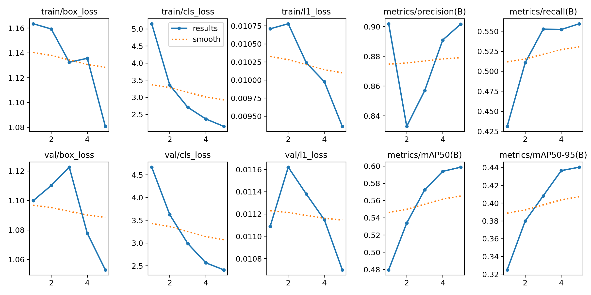
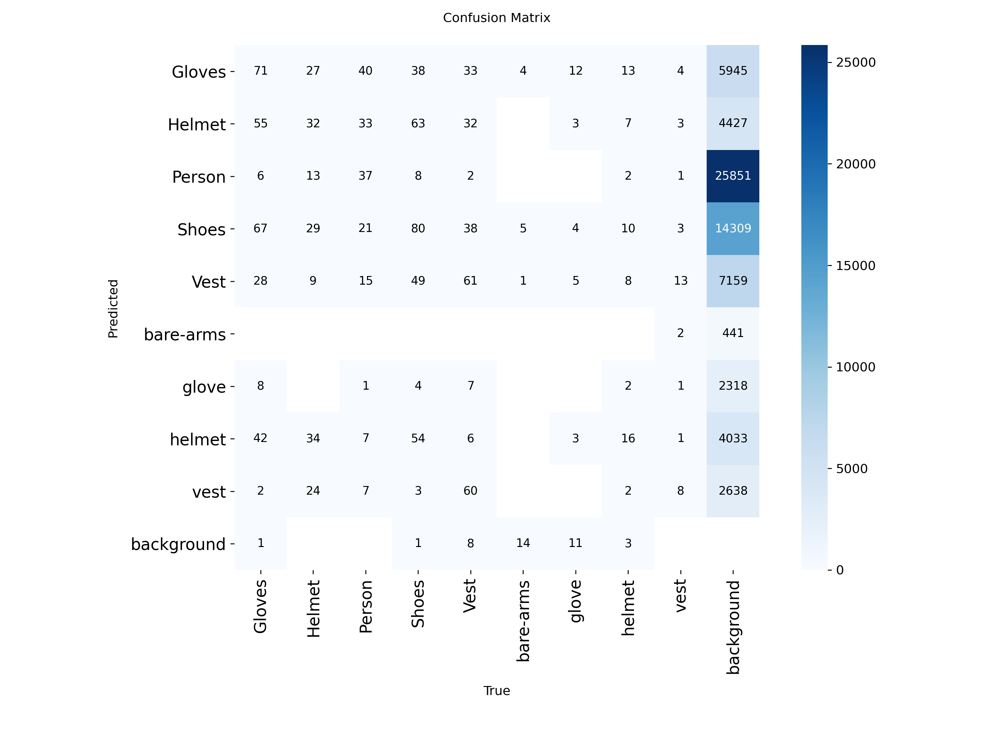
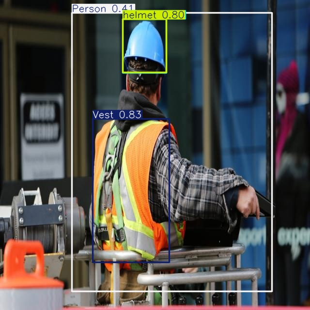
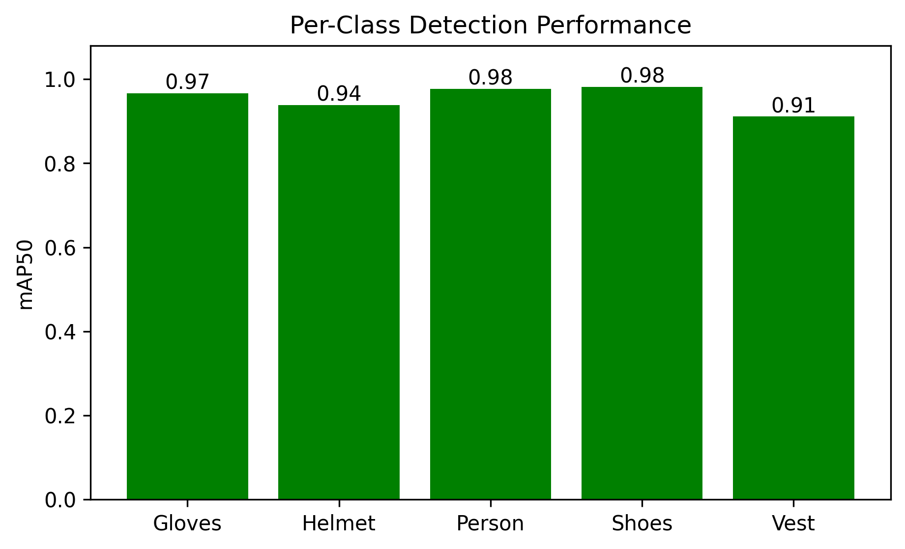

# Workers Safety Equipment Detection using YOLO

An object detection project that identifies personal protective equipment (PPE) — helmets, vests, gloves, shoes — and people in workplace images, using a fine-tuned YOLO model.

## 📌 Overview
This project trains a YOLO object detection model on a custom Roboflow dataset to automatically detect safety equipment in workplace photos. Unlike classification (one label per image), object detection locates and labels multiple objects within a single image using bounding boxes.

## 🛠️ Tech Stack
- Python
- Ultralytics YOLO
- Roboflow (dataset management)
- Google Colab (GPU training)

## 📊 Dataset
- Source: Roboflow — "Workers Safety Equipment" (workspace: `wyhil-ru2ds`)
- Format: YOLOv11, with separate `train/`, `valid/`, and `test/` folders
- Classes: Gloves, Helmet, Person, Shoes, Vest

## ⚙️ Workflow
1. Downloaded and prepared the dataset via the Roboflow API
2. Trained a YOLO model for 5 epochs at 640×640 image size
3. Validated performance on the held-out validation set
4. Ran inference on test images to generate predictions
5. Evaluated results with per-class metrics and visualizations

## 📈 Results
- **mAP50:** 0.599
- **mAP50-95:** 0.440
- **Precision:** 0.901
- **Recall:** 0.559

| Class | mAP50 |
|---|---|
| Shoes | 0.982 |
| Person | 0.977 |
| Gloves | 0.967 |
| Helmet | 0.938 |
| Vest | 0.911 |

**Note:** the dataset contained a few duplicate classes with inconsistent casing (e.g. `Helmet` vs `helmet`), which appear to come from merging two differently-labeled sources. These duplicate classes had very few training examples and performed poorly, which pulled down the overall average metrics — the five main classes above perform strongly on their own.

## 🖼️ Visualizations

### Training Curves

*Loss and metric curves across training epochs.*

### Confusion Matrix

*Model predictions vs actual classes on the validation set.*

### Sample Predictions

*Bounding boxes and labels predicted on unseen test images.*

### Per-Class Performance

*mAP50 broken down by safety equipment class.*

## 🚀 How to Run
1. Clone the repository
2. Install dependencies:
```bash
   pip install ultralytics roboflow
```
3. Open `Object_Detection_Using_Custom_Dataset.ipynb` in Google Colab (GPU runtime recommended)
4. Run all cells to download the dataset, train, and generate predictions

## 👤 Author
Nazma Begum — [GitHub](https://github.com/Nijhumtara)
